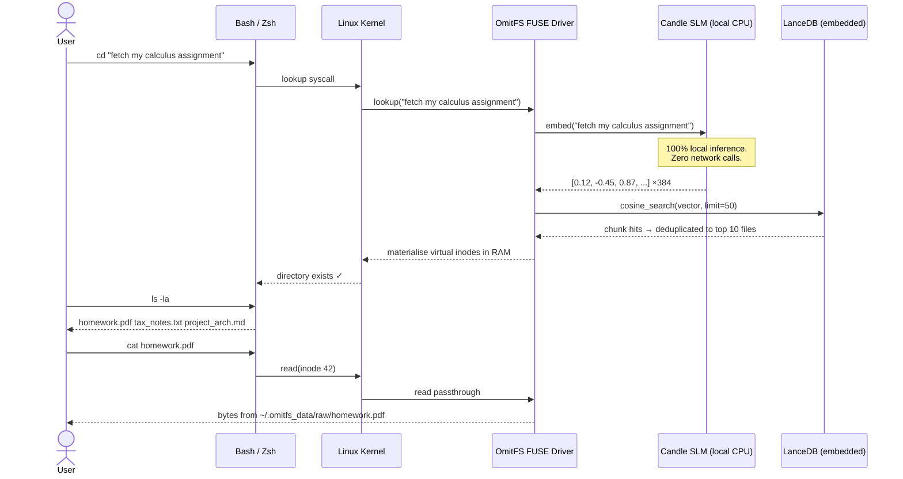
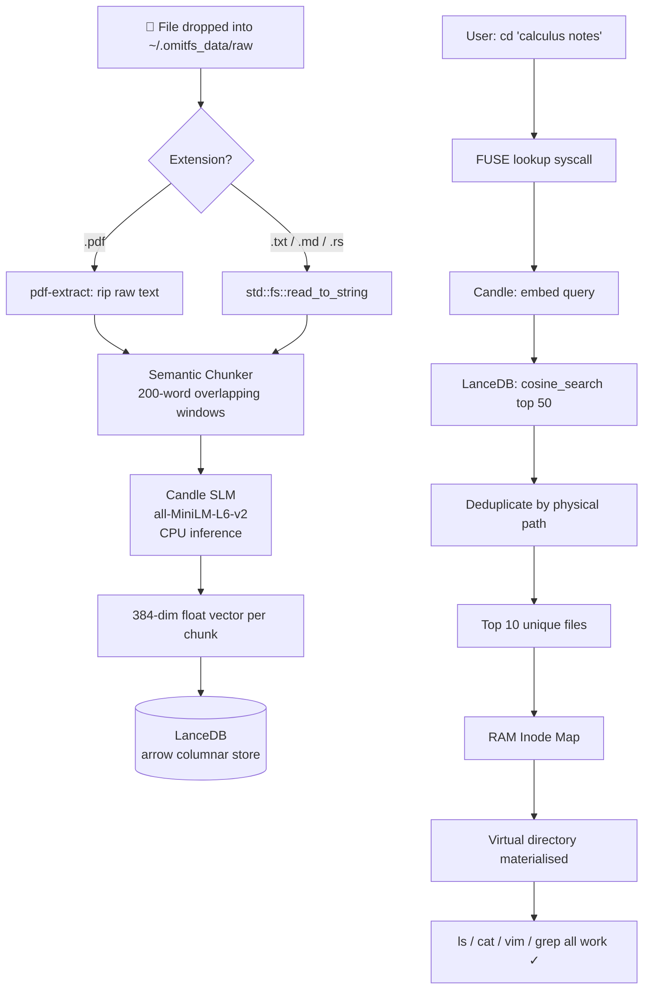

<div align="center">

<!-- Animated SVG Title Banner -->


<br/>

[](https://www.rust-lang.org)
[](https://github.com/libfuse/libfuse)
[](https://lancedb.com/)
[](https://github.com/huggingface/candle)
[](./LICENSE)

<br/>

> *"The directory tree was invented in 1964. OmitFS buries it."*

</div>

---

<!-- Animated separator -->


## 📖 The Story: Why This Exists

Your file is named `homework.pdf`.  
Its contents? Pure **Calculus Integration**. Derivatives. Integrals. Problem sets.

You type: `find . -name "*calculus*"` — nothing.  
You type: `ls ~/Documents` — 400 files stare back at you blankly.  
You dig through folders for 10 minutes.

**This is the broken 1964 paradigm we have accepted as normal.**

OmitFS shatters it. It does not care about your file's name. It reads the **meaning** of your content, embeds it into a 384-dimensional mathematical space, and when you ask for *"calculus notes"*, it surfaces `homework.pdf` instantly — because that file **is** your calculus notes, regardless of what you named it.

---


## ⚙️ How OmitFS Works — The Full Pipeline

```
 Your file lands in the void       The SLM reads the content           LanceDB stores the meaning
 ─────────────────────────        ────────────────────────────        ─────────────────────────────
  ~/.omitfs_data/raw/             homework.pdf  ──►  "solve the      [ 0.12, -0.45, 0.87, ...   ]
  ├── homework.pdf                integral of x^2..."                 384 dimensions of meaning
  ├── tax_notes.txt                     │                              stored in embedded LanceDB
  └── project_arch.md             Chunked into 200-word               without a single network call
                                   overlapping segments
                                   → vectorised by Candle SLM
```

```
  You type a command              FUSE intercepts the kernel call       Virtual folder materialises
  ─────────────────────          ─────────────────────────────────     ──────────────────────────
  cd "calculus notes"    ──►     lookup("calculus notes") fired   ──►  RAM inode map created
                                 query embedded by SLM                  homework.pdf (inode 42)
                                 cosine similarity search                ↓
                                 in LanceDB → top 10 unique files       ls -la works
                                 deduplicated by physical path          cat works
                                                                        vim works
```

---



---



---


## 🏗️ Architecture — Module Map

```
OmitFS/
│
├── Cargo.toml                   ← All dependencies. One binary. No Docker.
│
└── src/
    ├── main.rs                  ← CLI router (clap) + async ingestion daemon loop
    │                              Subcommands: init · daemon · mount · select
    │
    ├── fuse.rs                  ← FUSE kernel bridge (fuser crate)
    │   ├── lookup()             ← Intercepts cd. Triggers SLM query. Returns virtual inode.
    │   ├── getattr()            ← Feeds real byte-size, timestamp, permissions to OS
    │   ├── readdir()            ← Powers ls -la inside hallucinated directories
    │   ├── open() / read()      ← Maps virtual inode reads to physical file bytes
    │   ├── unlink()             ← rm file.pdf → deletes from physical void
    │   └── rename()             ← mv file.pdf ~/docs/ → moves physical file, updates map
    │
    ├── embedding.rs             ← Hugging Face Candle SLM engine
    │   ├── EmbeddingEngine::new()   ← Downloads + caches model weights locally
    │   └── embed(&str) → Vec<f32>  ← Tokenize → forward pass → CLS pooling → 384-dim vector
    │
    ├── db.rs                    ← LanceDB embedded vector store
    │   ├── OmitDb::init()       ← Creates arrow schema [file_id, filename, path, vector]
    │   ├── insert_file()        ← Inserts one chunk vector row
    │   └── search()             ← Cosine similarity search, deduplicates by physical path
    │
    └── watcher.rs               ← notify crate: async inotify/FSEvents watcher
        └── start_watcher()      ← Sends file events → tokio mpsc channel → ingestion loop

~/.omitfs_data/                  ← Runtime data (created by `omitfs init`)
├── raw/                         ← THE VOID. Drop files here.
├── lancedb/                     ← Embedded vector DB binary files
└── omitfs.log                   ← Rotating diagnostic log
```

---


## 🛡️ Engineering Principles

| Principle | What It Means |
|-----------|--------------|
| 🦀 **Bare-metal Rust** | No GC pauses. No runtime. Sub-millisecond cold paths. |
| 🔒 **Air-Gapped Privacy** | Zero network calls. Model weights cached locally. No OpenAI. No telemetry. |
| 📦 **Zero External Dependencies** | One binary. No Python. No Docker. No database server. |
| ✅ **POSIX Compliance** | Real `stat()` data. Real permissions. `vim`, `grep`, `cat` work with zero friction. |
| 🧠 **Content-Aware Search** | Indexes file *content*, not filenames. `homework.pdf` beats `assignment.pdf` for calculus queries. |
| ⚡ **Semantic Chunking** | 200-word overlapping windows ensure large documents are fully indexed, not just the first page. |

---


## ⚡ Quick Start

### Prerequisites
```bash
# Rust toolchain
curl --proto '=https' --tlsv1.2 -sSf https://sh.rustup.rs | sh

# FUSE kernel headers (Linux)
sudo apt install libfuse-dev pkg-config

# macOS — FUSE already supported via macFUSE
brew install macfuse
```

### Build
```bash
git clone https://github.com/Panav-Payappagoudar/OmitFS.git
cd OmitFS
cargo build --release
# Binary at: ./target/release/omitfs
```

### Run
```bash
# Step 1 — Initialize the void and download model weights (~80MB, one-time)
./target/release/omitfs init

# Step 2 — Start the background ingestion daemon (keep this terminal open)
./target/release/omitfs daemon

# Step 3 — In a new terminal, mount the semantic filesystem
mkdir -p ~/OmitFS_Mount
./target/release/omitfs mount ~/OmitFS_Mount
```

---


## 🗂️ Full Command Reference

### Core Lifecycle
| Command | What It Does |
|---------|-------------|
| `omitfs init` | Creates `~/.omitfs_data/raw`, initializes LanceDB, downloads SLM weights |
| `omitfs daemon` | Starts background watcher. Ingests every file dropped into the raw vault |
| `omitfs mount <path>` | Attaches the FUSE kernel driver to `<path>`. All `cd`/`ls`/`cat` routed through OmitFS |

### POSIX Commands (inside the mount)
| Command | What It Does |
|---------|-------------|
| `cd "~/OmitFS_Mount/<your intent>"` | Performs semantic query. Materialises virtual directory in RAM |
| `ls -la` | Lists all semantically matched files with real sizes and timestamps |
| `cat <file>` | Streams bytes from the physical file in the void |
| `vim <file>` | Full read/write access to the physical file |
| `grep "keyword" <file>` | Works natively — real byte passthrough |
| `rm <file>` | Triggers FUSE `unlink()` → deletes physical file from the void |
| `mv <file> <destination>` | Triggers FUSE `rename()` → physically moves file, updates inode map |

### Interactive File Manager
| Command | What It Does |
|---------|-------------|
| `omitfs select "<query>"` | Semantic search → numbered file list → interactive action menu |

**Actions available inside `omit select`:**

```
  [o] Open       — Opens with $EDITOR (or xdg-open / open on macOS)
  [d] Delete     — Permanently removes the file from the void
  [p] Print path — Copies/prints the absolute physical path
  [c] Copy       — Duplicates file to a user-specified destination
  [m] Move       — Relocates the physical file to a new path
  [q] Quit       — Exit without action
```

**Example session:**
```bash
$ omitfs select "my calculus assignment"

🔍 Searching for: "my calculus assignment"...

Found 3 file(s):

  [1] homework.pdf     →  ~/.omitfs_data/raw/homework.pdf
  [2] lecture_notes.md →  ~/.omitfs_data/raw/lecture_notes.md
  [3] practice_set.txt →  ~/.omitfs_data/raw/practice_set.txt

Select a file number (or 0 to quit): 1

Selected: homework.pdf  (~/.omitfs_data/raw/homework.pdf)

What would you like to do?
  [o] Open   — opens with $EDITOR / xdg-open
  [d] Delete — permanently removes the file from the void
  [p] Print path — prints the physical path to stdout
  [c] Copy   — duplicates the file to a new location
  [m] Move   — relocates the file to a new path
  [q] Quit

Choice: m
Destination path (e.g. ~/Documents/moved.pdf): ~/Desktop/homework.pdf
Moved → /home/user/Desktop/homework.pdf
```

---


## 📦 Full Dependency Stack

| Crate | Role |
|-------|------|
| `fuser` | FUSE kernel bridge — intercepts all POSIX syscalls |
| `candle-core` + `candle-transformers` | Local SLM inference engine (HuggingFace, Rust-native) |
| `lancedb` + `arrow-array` | Embedded columnar vector database |
| `hf-hub` + `tokenizers` | Model weight fetching + BPE tokenization |
| `notify` | Native OS file system events (inotify / FSEvents) |
| `tokio` | Async runtime — watcher, DB queries, signal handling |
| `clap` | Zero-boilerplate CLI with `derive` macros |
| `tracing` + `tracing-appender` | Async structured logging to rolling log file |
| `anyhow` + `thiserror` | Ergonomic error propagation |
| `pdf-extract` | Native PDF text extraction (no Poppler, no Python) |
| `shellexpand` | Tilde path expansion in `select` file manager |
| `uuid` | Unique chunk IDs for LanceDB rows |

---

<div align="center">
<br/>

<br/><br/>

**MIT License** · Built in 🦀 Rust · Powered by [HuggingFace Candle](https://github.com/huggingface/candle) · Stored by [LanceDB](https://lancedb.com/)

</div>
