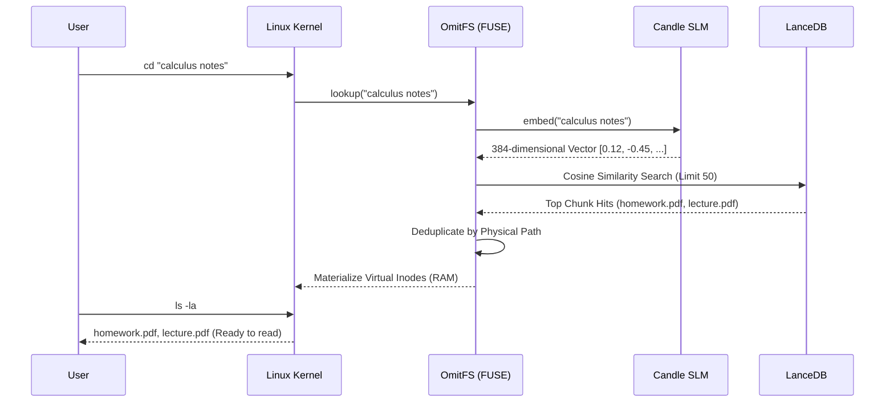

<div align="center">

# 🌌 OmitFS
**Intent-Driven Semantic File Routing for the Modern Operating System**

[](https://www.rust-lang.org)
[](https://github.com/libfuse/libfuse)
[](https://lancedb.com/)
[](https://github.com/huggingface/candle)

*OmitFS obliterates the 50-year-old paradigm of hierarchical directory trees. It replaces rigid folders with a high-dimensional, LLM-powered latent space directly inside your OS kernel.*

---

*(Imagine a sleek terminal GIF here where `cd "calculus notes"` instantly reveals `homework.pdf`)*
</div>

---

## 📖 The Narrative: Why OmitFS Exists

**The Problem:** The hierarchical directory tree was introduced in 1964. We are still using the exact same structure today. We force human brains to memorize arbitrary file paths, obscure folder names, and rigid organizational systems just to find a single document. 

What happens when you name a file `homework.pdf`, but its contents are entirely about *Calculus Integration*? If you search your computer for "calculus assignment", traditional filesystems fail because the *filename* doesn't match the *intent*.

**The Solution:** OmitFS is a zero-dependency semantic file system. It abandons rigid paths entirely. **You simply tell the operating system what you want.** The physical hard drive acts as a flat, hidden void. Directories are hallucinated in real-time based purely on your semantic intent, scanning the **deep content** of your files, not just their superficial names.

---

## ⚙️ The Core Mechanics (Content-Aware Chunking)

1. **The Hidden Void**: Standard directories no longer exist. All files (PDFs, Markdown, Text) are ingested into a single, flat, hidden physical directory. 
2. **Deep Semantic Chunking**: As a file (like `homework.pdf`) is dropped into the void, OmitFS extracts the raw text and slices it into **overlapping 200-word semantic chunks**. 
3. **Local Embedding**: Each chunk is passed through a local Hugging Face SLM (`all-MiniLM-L6-v2`) and converted into 384-dimensional mathematical vectors. This guarantees that a calculus equation on page 14 of `homework.pdf` is perfectly indexed.
4. **Dynamic Hallucination**: When you type `cd "fetch me my calculus assignment"`, OmitFS intercepts the kernel call, mathematically embeds your prompt, deduplicates the chunk hits, and instantly generates a virtual folder in RAM containing `homework.pdf`.

---

## 🏗️ Technical Architecture & Constraints



### Absolute Constraints
- 🦀 **Language**: Pure Rust. Chosen for bare-metal speed and memory safety.
- 🌉 **The OS Bridge (`fuser`)**: Intercepts POSIX system calls (`cd`, `ls`, `cat`) directly.
- 🧠 **The Inference Engine (`candle`)**: Runs 100% locally on the CPU.
- 🗄️ **The Vector Database (`LanceDB`)**: Embedded inside the binary for hyper-fast search.
- 🛡️ **Air-Gapped Privacy**: Zero Docker containers. Zero Python environments. Zero data sent to OpenAI. **100% offline.**

---

## 📂 System File Tree

```text
OmitFS/
├── Cargo.toml               # Dependency Manifest (Fuser, Candle, LanceDB, pdf-extract)
├── src/
│   ├── main.rs              # CLI Router & Background Daemon Ingestion Loop
│   ├── db.rs                # LanceDB initialization and vector insertion/searching
│   ├── embedding.rs         # Hugging Face SLM weight loading and text vectorization
│   ├── watcher.rs           # Asynchronous physical directory monitoring
│   └── fuse.rs              # POSIX kernel interception and RAM Inode mapping
└── ~/.omitfs_data/          # Generated at runtime
    ├── raw/                 # The physical "Void" where raw files are dropped
    ├── lancedb/             # The embedded vector database binaries
    └── omitfs.log           # Background diagnostic tracing
```

---

## ⚡ Quick Start & Usage

### 1. Prerequisites
You will need Rust and a FUSE-compatible OS (Linux or macOS / WSL2 for Windows).
```bash
# Install FUSE dependencies (Ubuntu/Debian)
sudo apt install libfuse-dev
```

### 2. Compile the System
```bash
git clone https://github.com/Panav-Payappagoudar/OmitFS.git
cd OmitFS
cargo build --release
```

### 3. Initialize & Mount the Void
```bash
# Initialize the hidden void and Vector DB
./target/release/omitfs init

# Start the background daemon (Run in a separate terminal)
./target/release/omitfs daemon

# Mount the FUSE driver
mkdir -p ~/OmitFS_Mount
./target/release/omitfs mount ~/OmitFS_Mount
```

### 4. Navigate by Meaning
Drop PDFs or text files into `~/.omitfs_data/raw`. The daemon will automatically extract the text, chunk it, and embed it.

```bash
# The OS queries your semantic intent
cd "~/OmitFS_Mount/fetch me my calculus assignment"

# The terminal reveals `homework.pdf` because its deep contents match your intent!
ls -la

# Interact with the virtual file
cat homework.pdf
```

---

<div align="center">
<i>Built for the future of the Operating System.</i>
</div>
