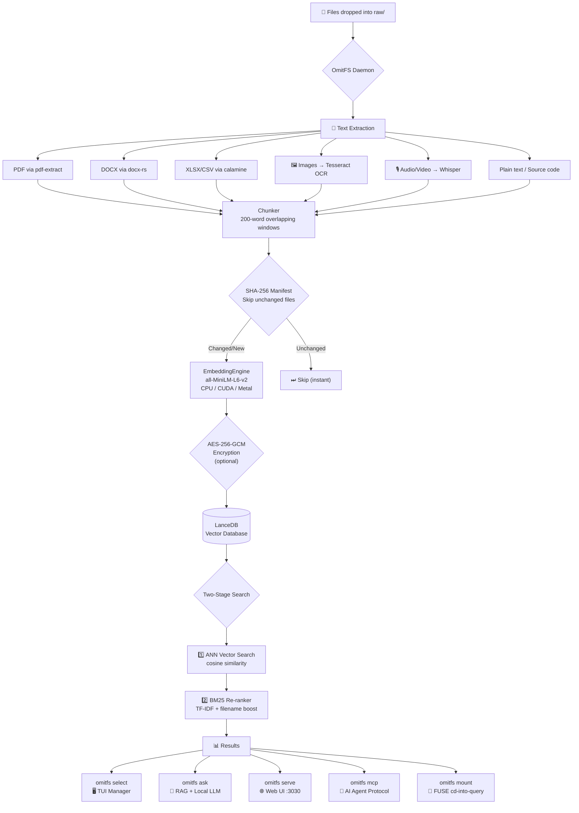
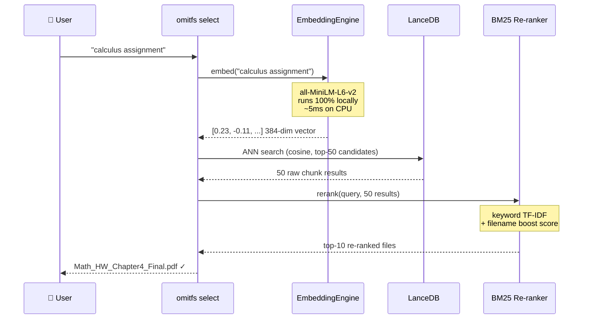
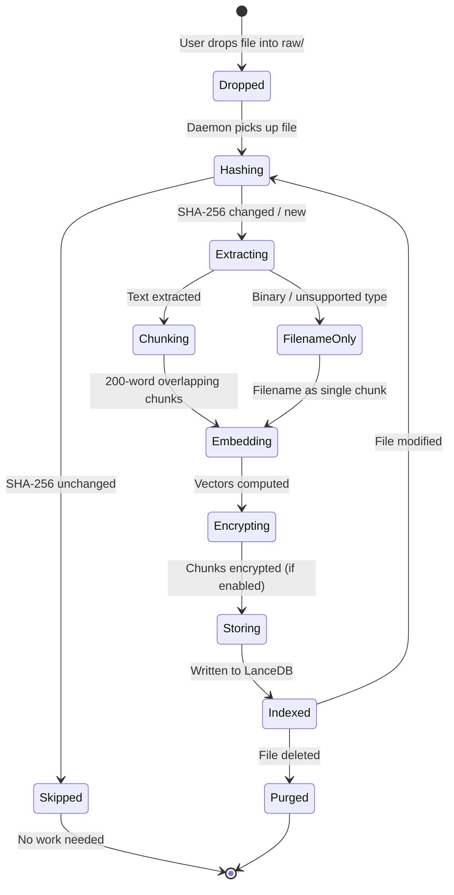

<div align="center">


<a href="https://git.io/typing-svg"></a>

<br/>

[](https://www.rust-lang.org/)
[](#)
[](#)
[](#)

[](https://github.com/Panav-Payappagoudar/OmitFS/releases)
[](LICENSE)
[](https://github.com/Panav-Payappagoudar/OmitFS/releases)
[](https://github.com/Panav-Payappagoudar/OmitFS/actions)

<br/>

> **Search your files the way you think about them — not by filename.**  
> *"my calculus assignment from last week"* → finds it instantly.  
> **No cloud. No API. No token limits. No compromise. Forever offline.**

</div>

---

## ⚡ One-Line Install

<table>
<tr>
<td><strong>🍎 macOS / 🐧 Linux</strong></td>
<td>

```bash
curl -sSf https://raw.githubusercontent.com/Panav-Payappagoudar/OmitFS/main/install.sh | sh
```

</td>
</tr>
<tr>
<td><strong>🪟 Windows PowerShell</strong></td>
<td>

```powershell
irm https://raw.githubusercontent.com/Panav-Payappagoudar/OmitFS/main/install.ps1 | iex
```

</td>
</tr>
</table>

> The installer automatically: detects your OS, downloads the pre-built binary, patches your `PATH`, pulls the Ollama `llama3` model, and runs `omitfs init`. One command, fully operational.

---

## 🧠 What is OmitFS?

OmitFS is a **production-grade, 100% local** semantic file system written entirely in Rust. It indexes your files using a locally-running transformer (`all-MiniLM-L6-v2`, ~80 MB) and stores their *meaning* — not just their name — in a local vector database (LanceDB).

<div align="center">

| You type | OmitFS finds |
|:---------|:------------|
| `"calculus assignment"` | `Math_HW_Chapter4_Final.pdf` |
| `"meeting notes from last sprint"` | `2024-03-15_standup.docx` |
| `"the production API config"` | `config/prod.env` |
| `"my resume"` | `CV_2024_v3.pdf` |
| 🖼️ Text inside a screenshot | Indexed automatically via OCR |
| 🎙️ Words spoken in a voice memo | Indexed automatically via Whisper |

</div>

---

## 🔒 Local-First & Air-Gapped

<div align="center">

```
┌─────────────────────────────────────────────────────────────┐
│                     Your Machine Only                        │
│                                                             │
│  ┌──────────┐   ┌────────────┐   ┌──────────────────────┐  │
│  │  Files   │──▶│  OmitFS   │──▶│  LanceDB (vectors)  │  │
│  │  raw/    │   │  Daemon   │   │  ~/.omitfs_data/     │  │
│  └──────────┘   └────────────┘   └──────────────────────┘  │
│                        │                                     │
│               ┌────────▼──────┐                             │
│               │  all-MiniLM  │  ← Runs on CPU/GPU locally  │
│               │  L6-v2 model │  ← No API. No limits.       │
│               └───────────────┘                             │
│                                                             │
│                 ✗ No OpenAI    ✗ No Anthropic               │
│                 ✗ No Cloud     ✗ No Internet Required        │
└─────────────────────────────────────────────────────────────┘
```

</div>

- **No Token Limits** — The embedding model processes unlimited text locally
- **No API Keys** — Never touches any external service after initial model download
- **Air-Gapped Ready** — Place model files in `~/.omitfs_data/model/` for fully offline use
- **AES-256-GCM Encryption** — Optional encryption of all indexed metadata at rest

---

## 🏗 Architecture



---

## 🔄 Search Pipeline (Sequence Diagram)



---

## 📂 File Lifecycle (State Diagram)



---

## 🚀 Quick Start

### After the one-line install:

```bash
# 1. Drop your files in
cp ~/Documents/*.pdf ~/.omitfs_data/raw/
cp ~/Desktop/*.docx ~/.omitfs_data/raw/

# 2. Start the background daemon (watches for new files in real-time)
omitfs daemon &

# 3. Search semantically — no exact filenames needed
omitfs select "calculus assignment"

# 4. Or use the beautiful web UI
omitfs serve
# → Open http://localhost:3030

# 5. Ask AI questions about your files (requires Ollama)
omitfs ask "What integral technique did I use in problem 4?"
```

### Manual Install (Build From Source)

```bash
# Requires Rust 1.75+
git clone https://github.com/Panav-Payappagoudar/OmitFS
cd OmitFS
cargo build --release
./target/release/omitfs init

# GPU acceleration (optional, much faster indexing)
cargo build --release --features cuda    # NVIDIA
cargo build --release --features metal   # Apple Silicon
```

---

## 🛠 Full Command Reference

<div align="center">

| Command | Description | Notes |
|:--------|:-----------|:------|
| `omitfs init` | Create dirs, download model weights | One-time setup |
| `omitfs daemon` | Watch `raw/`, auto-index files | Keep running |
| `omitfs reindex` | Force re-embed all files | Ignores SHA manifest |
| `omitfs select "<query>"` | TUI: search → open/copy/move/delete | Interactive |
| `omitfs ask "<question>"` | RAG Q&A over your files | Needs Ollama |
| `omitfs serve [--port N]` | Web UI + REST API | Default: 3030 |
| `omitfs mcp` | MCP tool server for AI agents | Stdio protocol |
| `omitfs mount <dir>` | FUSE virtual filesystem | Unix only |
| `omitfs install-service` | Register daemon as OS service | Auto-start at login |
| `omitfs uninstall-service` | Remove the OS service | — |

</div>

---

## 📂 Supported File Types

<div align="center">

| Category | Formats | Engine |
|:---------|:--------|:-------|
| 📄 **Documents** | `.pdf` | `pdf-extract` (text layer, no OCR needed) |
| 📝 **Word** | `.docx` | `docx-rs` — full paragraph extraction |
| 📊 **Spreadsheets** | `.xlsx` `.xls` `.ods` `.csv` | `calamine` — all sheets, all cells |
| 💻 **Code & Text** | `.rs` `.py` `.js` `.ts` `.go` `.java` `.cpp` `.md` `.json` `.yaml` `.toml` … | UTF-8 direct read |
| 🖼️ **Images** *(auto)* | `.jpg` `.png` `.gif` `.bmp` `.tiff` | **Tesseract OCR** (auto-detected) |
| 🎙️ **Audio/Video** *(auto)* | `.mp3` `.mp4` `.wav` `.mov` `.flac` `.webm` | **Whisper** transcription (auto-detected) |
| 📦 **Anything else** | `.zip` `.exe` `.psd` … | Filename indexed, content skipped |

</div>

> 💡 **Tesseract** and **Whisper** activate automatically if found on your `PATH`. If not installed, OmitFS gracefully skips those file types — zero crashes, zero errors.

---

## 🤖 Ask AI — Local RAG Pipeline

**No API key. No internet. No monthly bill.**

```
Question: "What formula did I use in problem 4?"
         │
         ▼
[1]  Embed question locally         all-MiniLM-L6-v2 → 384-dim vector (5ms)
         │
         ▼
[2]  Retrieve top chunks            LanceDB ANN + BM25 re-ranking
         │
         ▼
[3]  Build context prompt           Chunks injected as grounding context
         │
         ▼
[4]  Generate answer                Local Ollama (llama3/phi4/mistral/etc.)
         │
         ▼
[5]  Stream answer token-by-token   Printed to terminal in real-time
```

```bash
# Change the model in config.toml:
ollama_model = "phi4"      # Microsoft Phi-4 (fast, smart)
ollama_model = "llama3"    # Meta Llama 3 (default)
ollama_model = "mistral"   # Mistral 7B
ollama_model = "deepseek-r1"  # DeepSeek R1 (best reasoning)
```

---

## 🔌 MCP — AI Agent Integration

OmitFS works as a native tool for Claude Desktop, Cursor, and Continue.

**Claude Desktop** (`claude_desktop_config.json`):

```json
{
  "mcpServers": {
    "omitfs": {
      "command": "omitfs",
      "args": ["mcp"]
    }
  }
}
```

**Cursor** (`.cursor/mcp.json`):

```json
{
  "mcpServers": [{
    "name": "omitfs",
    "command": "omitfs mcp"
  }]
}
```

| MCP Tool | Arguments | What It Does |
|:---------|:----------|:------------|
| `search` | `query: string, limit?: int` | Semantic search over all local files |
| `ask` | `question: string, model?: string` | RAG Q&A grounded in local files |

---

## 🔒 Encryption at Rest

Enable in one line:

```toml
# ~/.omitfs_data/config.toml
encryption_enabled = true
```

- Generates a **random 256-bit AES-GCM key** on first run
- Stored at `~/.omitfs_data/encryption.key` (Unix: `0600` permissions)
- Encrypts **chunk text** before it is written to LanceDB
- Your original files in `raw/` are **never modified**

> ⚠️ Back up `encryption.key`. If lost, indexed content is inaccessible (original files remain intact).

---

## ⚙️ Configuration

```toml
# ~/.omitfs_data/config.toml (auto-generated on init)

# ── Search ─────────────────────────────────────────
max_results      = 10     # files returned per query
overfetch_factor = 5      # ANN over-fetch for BM25 re-ranking
chunk_words      = 200    # words per embedding chunk
overlap_words    = 50     # overlap between adjacent chunks

# ── Web UI + RAG ────────────────────────────────────
serve_port    = 3030
ollama_url    = "http://localhost:11434"
ollama_model  = "llama3"

# ── Security ────────────────────────────────────────
encryption_enabled = false   # AES-256-GCM chunk encryption

# ── Multi-Modal (degrade gracefully if not installed) ─
ocr_enabled     = true   # Tesseract image OCR
whisper_enabled = true   # Whisper audio transcription
```

---

## 🖥️ Desktop GUI (Tauri)

The `gui/` directory contains a native desktop app:

- **`Ctrl+Space`** — global hotkey to instantly show search anywhere on screen
- **System tray** — hide to tray; OmitFS is always one keystroke away
- **Frameless transparent window** — floats above other apps
- Hosts the full web UI inside a native WebView

```bash
# Prerequisites: Node.js 18+ and Rust
cd gui
npm install
npm run dev     # development
npm run build   # creates .msi / .dmg / .AppImage
```

---

## 📈 Performance

<div align="center">

| Operation | CPU (i7-12th gen) | GPU (RTX 3080) |
|:----------|:-----------------:|:--------------:|
| Embed one chunk (~200 words) | ~25 ms | ~2 ms |
| Index 1,000 text files | ~4 min | ~20 sec |
| Search (query → results) | ~60 ms | ~10 ms |
| RAG answer (Llama3 8B) | ~8 sec | ~0.8 sec |
| Daemon restart (files unchanged) | **instant** | **instant** |

</div>

> The SHA-256 manifest means the daemon never re-indexes files that haven't changed. Even with 100,000 files, restarts are instantaneous.

---

## 🗺️ Roadmap

<div align="center">

| Feature | Status |
|:--------|:------:|
| Local vector search (all-MiniLM-L6-v2) | ✅ |
| BM25 keyword re-ranking | ✅ |
| PDF, DOCX, XLSX parsing | ✅ |
| Image OCR (Tesseract) | ✅ |
| Audio/video transcription (Whisper) | ✅ |
| AES-256-GCM encryption at rest | ✅ |
| Incremental indexing (SHA-256 manifest) | ✅ |
| RAG Q&A (local Ollama, no API) | ✅ |
| Web UI + REST API | ✅ |
| MCP server (Claude Desktop / Cursor) | ✅ |
| FUSE virtual filesystem (Unix) | ✅ |
| Tauri desktop GUI + global hotkey | ✅ |
| Cross-platform CI/CD (GitHub Actions) | ✅ |
| One-line installer (macOS/Linux/Windows) | ✅ |
| Team LAN sync (P2P, no cloud) | 🔄 |
| Browser extension (web clipper) | 🔄 |
| Stripe billing + license keys | 🔄 |
| Enterprise SSO / audit logs | 🔄 |

</div>

---

## 📜 License

MIT © 2024 [Panav Payappagoudar](https://github.com/Panav-Payappagoudar)

<div align="center">

<br/>

**If OmitFS saved you time, leave a ⭐ — it means a lot.**


</div>
