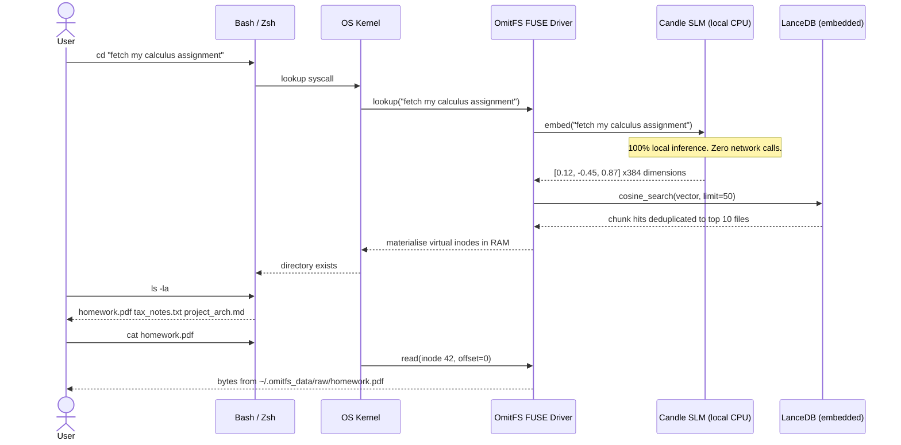
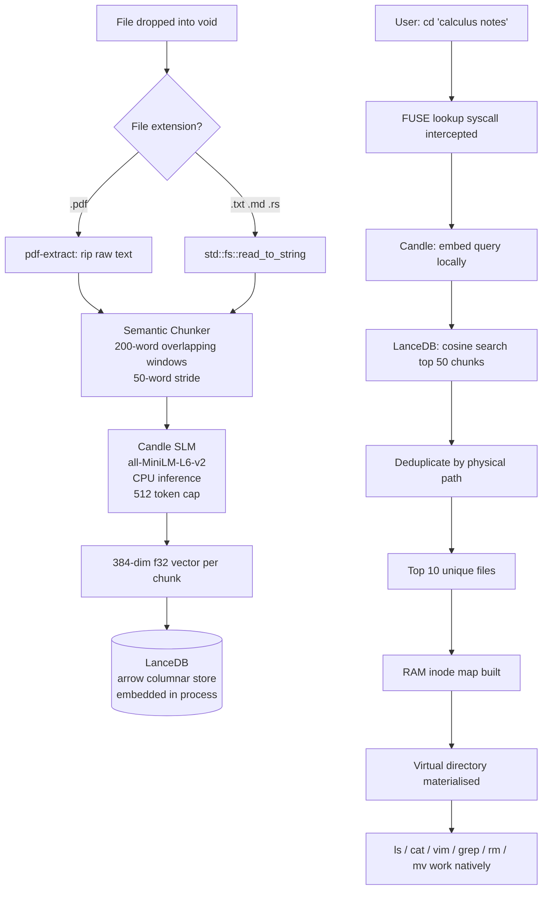

<div align="center">

<!-- Animated header using capsule-render (works reliably on GitHub) -->


<br/>

<!-- Tech badges -->
[](https://www.rust-lang.org)
[](https://github.com/libfuse/libfuse)
[](https://lancedb.com/)
[](https://github.com/huggingface/candle)
[](./LICENSE)
[](https://github.com/Panav-Payappagoudar/OmitFS)

<br/>

> *"The directory tree was invented in 1964. OmitFS buries it."*

<br/>

</div>

---

## 📖 The Story: Why This Exists

Your file is named `homework.pdf`.
Its contents? Pure **Calculus Integration** — derivatives, integrals, problem sets.

You type `find . -name "*calculus*"` — nothing.
You scan through 400 files in `~/Documents` for 10 minutes.

**This is the broken 1964 paradigm we've accepted as normal.**

OmitFS shatters it. It doesn't care about your file's name. It reads the **meaning** of your content, embeds it into a 384-dimensional mathematical space, and when you ask for *"calculus notes"*, it surfaces `homework.pdf` instantly — because that file **is** your calculus notes, regardless of what you called it.

---

## ⚙️ How It Works — The Full Pipeline

```
  DROP FILE                  EMBED CONTENT                STORE MEANING
  ─────────────────          ──────────────────────────   ─────────────────────────────
  ~/.omitfs_data/raw/        homework.pdf                 [ 0.12, -0.45, 0.87, ...   ]
  ├── homework.pdf    ──►    "solve the integral of  ──►  384 floats of pure meaning
  ├── tax_notes.txt          x^2..."                      stored in embedded LanceDB
  └── arch_diagram.md        chunked into 200-word        zero network calls
                             overlapping windows
                             → embedded by Candle SLM
```

```
  NAVIGATE                   FUSE INTERCEPTS               VIRTUAL FOLDER APPEARS
  ─────────────────          ──────────────────────────    ──────────────────────────
  cd "calculus notes" ──►    lookup("calculus notes")  ──► homework.pdf  (inode 42)
                             query embedded by SLM         lecture_notes.md (inode 43)
                             cosine search in LanceDB       practice_set.txt (inode 44)
                             → top 10 unique files
                             deduplicated by path           cat / vim / grep all work
```

---

## 🗺️ System Flow Diagrams





---

## 🏗️ Module Architecture

```
OmitFS/
│
├── Cargo.toml                   ── All dependencies. One binary. No Docker. No Python.
│
└── src/
    ├── main.rs                  ── CLI router (clap) + ingestion daemon + select TUI
    │   ├── Commands::Init       ── Create ~/.omitfs_data, init LanceDB, download weights
    │   ├── Commands::Daemon     ── Watch raw/ dir, embed files, store in LanceDB
    │   ├── Commands::Mount      ── Attach FUSE kernel driver to mount point
    │   └── Commands::Select     ── Interactive semantic file manager (TUI)
    │
    ├── fuse.rs                  ── FUSE kernel bridge (fuser crate)
    │   ├── lookup()             ── Intercepts cd. Fires SLM. Returns virtual inode.
    │   ├── getattr()            ── Returns real byte-size, mtime, permissions to OS
    │   ├── readdir()            ── Powers ls -la inside hallucinated directories
    │   ├── open() + read()      ── Byte passthrough from physical void to terminal
    │   ├── unlink()             ── rm → physically deletes file from void
    │   └── rename()             ── mv → physically moves file, updates inode map
    │
    ├── embedding.rs             ── HuggingFace Candle SLM engine (100% local)
    │   ├── EmbeddingEngine::new() ── Caches weights in ~/.cache/huggingface/hub
    │   └── embed(&str) → Vec<f32> ── Tokenize → BertModel forward → CLS pool → 384d
    │
    ├── db.rs                    ── LanceDB embedded vector store
    │   ├── OmitDb::init()       ── Creates arrow schema [file_id, filename, path, vector]
    │   ├── insert_file()        ── Inserts one chunk vector row via RecordBatch
    │   └── search()             ── Cosine search, deduplicates results by physical path
    │
    └── watcher.rs               ── notify crate: inotify (Linux) / FSEvents (macOS)
        └── start_watcher()      ── Sends file events to tokio mpsc channel

~/.omitfs_data/                  ── Created by `omitfs init`
    ├── raw/                     ── THE VOID. Drop files here.
    ├── lancedb/                 ── Embedded vector DB (arrow IPC format)
    └── omitfs.log               ── Rotating structured log (daily rolling)
```

---

## 🛡️ Engineering Principles

| Principle | Implementation |
|---|---|
| 🦀 **Bare-metal Rust** | No GC pauses. Sub-ms cold paths. Edition 2021. |
| 🔒 **Air-Gapped Privacy** | Model weights cached in `~/.cache/huggingface/hub` on first run. No API keys. No telemetry. Fully offline after init. |
| 📦 **Zero External Deps** | Single binary. No Python. No Docker. No database server. |
| ✅ **Full POSIX Compliance** | Real `stat()` data — correct byte size, `mtime`, uid/gid, `-rw-r--r--` perms. |
| 🧠 **Content-Aware Search** | Indexes file *content*, not filenames. `homework.pdf` wins for "calculus" over `assignment.pdf`. |
| ⚡ **Semantic Chunking** | 200-word overlapping windows (50-word stride). Large documents fully indexed, not just the first page. |
| 🔄 **Chunk Deduplication** | Cosine search over-fetches 5× then deduplicates by physical path — each file appears once. |
| 🛡️ **Graceful POSIX Errors** | Embedding failure → `EIO`. File not found → `ENOENT`. Kernel never panics. |

---

## ⚡ Quick Start

### Prerequisites

```bash
# Rust toolchain
curl --proto '=https' --tlsv1.2 -sSf https://sh.rustup.rs | sh

# FUSE kernel headers — Linux
sudo apt install libfuse-dev pkg-config

# FUSE — macOS (via macFUSE)
brew install macfuse

# WSL2 on Windows — use Ubuntu and follow Linux steps above
```

### Build

```bash
git clone https://github.com/Panav-Payappagoudar/OmitFS.git
cd OmitFS
cargo build --release

# Binary at: ./target/release/omitfs
```

### Run

```bash
# Step 1 — Initialize the void and download SLM weights (~80 MB, one-time only)
./target/release/omitfs init

# Step 2 — Start the background ingestion daemon (keep this terminal alive)
./target/release/omitfs daemon

# Step 3 — In a new terminal, mount the semantic filesystem
mkdir -p ~/OmitFS_Mount
./target/release/omitfs mount ~/OmitFS_Mount
```

Drop files into `~/.omitfs_data/raw/` — the daemon picks them up automatically.

---

## 🗂️ Full Command Reference

### Core Lifecycle

| Command | What It Does |
|---|---|
| `omitfs init` | Creates `~/.omitfs_data/raw`, initializes LanceDB, downloads SLM weights to local cache |
| `omitfs daemon` | Watches the raw vault. Extracts text (including PDFs). Chunks and embeds every file. |
| `omitfs mount <path>` | Attaches the FUSE kernel driver. All `cd`/`ls`/`cat` routed through OmitFS. |
| `omitfs select "<query>"` | Interactive semantic file manager — search, open, copy, move, delete. |

### POSIX Commands Inside the Mount

| Command | What It Does |
|---|---|
| `cd "~/OmitFS_Mount/<your intent>"` | Semantic query. Materialises a virtual directory in RAM. |
| `ls -la` | Lists matched files with real sizes and timestamps |
| `cat <file>` | Streams bytes directly from the physical file |
| `vim <file>` | Full read access to the physical file |
| `grep "keyword" <file>` | Works natively — real byte passthrough |
| `rm <file>` | FUSE `unlink()` → permanently deletes physical file from the void |
| `mv <file> <dest>` | FUSE `rename()` → physically moves file, updates in-memory inode map |
| `cp <file> <dest>` | Standard copy via the mounted virtual file |

### Interactive File Manager (`omitfs select`)

```bash
$ ./target/release/omitfs select "my calculus assignment"

🔍  Searching: "my calculus assignment"

Found 3 file(s):

  [1]  homework.pdf      →  ~/.omitfs_data/raw/homework.pdf
  [2]  lecture_notes.md  →  ~/.omitfs_data/raw/lecture_notes.md
  [3]  practice_set.txt  →  ~/.omitfs_data/raw/practice_set.txt

Select number (0 to quit): 1

Selected: homework.pdf  (~/.omitfs_data/raw/homework.pdf)

  [o]  Open        — launch with $EDITOR / xdg-open
  [d]  Delete      — remove file permanently from the void
  [p]  Print path  — print absolute physical path
  [c]  Copy        — duplicate to a new location
  [m]  Move        — relocate the physical file
  [q]  Quit

Choice: m
Destination path: ~/Desktop/homework.pdf
Moved → /home/user/Desktop/homework.pdf
```

---

## 📦 Full Dependency Stack

| Crate | Version | Role |
|---|---|---|
| `fuser` | 0.14 | FUSE kernel bridge — intercepts all POSIX syscalls |
| `candle-core` + `candle-transformers` | 0.6 | Local SLM inference engine (HuggingFace, Rust-native) |
| `candle-nn` | 0.6 | VarBuilder for loading safetensors model weights |
| `lancedb` | 0.5 | Embedded columnar vector database |
| `arrow-array` + `arrow-schema` | 49 | Apache Arrow in-memory format for LanceDB |
| `hf-hub` | 0.3 | HuggingFace Hub cache — downloads model weights once |
| `tokenizers` | 0.19 | HuggingFace BPE/WordPiece tokenizer |
| `notify` | 6 | Native OS filesystem events (inotify / FSEvents / kqueue) |
| `tokio` | 1 | Async runtime — watcher, DB queries, signal handling |
| `clap` | 4 | Zero-boilerplate CLI with `derive` macros |
| `tracing` + `tracing-appender` | 0.1 / 0.2 | Async structured logging to daily rolling log file |
| `anyhow` + `thiserror` | 1 | Ergonomic error propagation with full context chains |
| `pdf-extract` | 0.7 | Native PDF text extraction (no Poppler, no Python) |
| `shellexpand` | 3 | Tilde path expansion in the `select` file manager |
| `uuid` | 1 | Unique chunk row IDs for LanceDB |
| `libc` | 0.2 | Real uid/gid for POSIX attributes |
| `dirs` | 5 | Cross-platform home directory resolution |
| `serde` + `serde_json` | 1 | BERT config.json deserialization |
| `futures` | 0.3 | Async stream iteration for LanceDB search results |

---

<div align="center">


**MIT Licensed · Built in Rust · Powered by [HuggingFace Candle](https://github.com/huggingface/candle) · Stored by [LanceDB](https://lancedb.com/)**

*Navigate by meaning. Not memory.*

</div>
