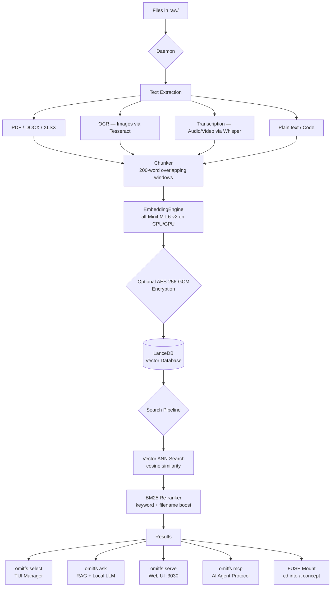

<div align="center">


[](https://www.rust-lang.org/)
[](LICENSE)
[](https://github.com/Panav-Payappagoudar/OmitFS/releases)
[](https://github.com/Panav-Payappagoudar/OmitFS)
[](https://github.com/Panav-Payappagoudar/OmitFS/releases)

<br/>

> **Search your files the way you think about them — not by filename.**  
> *"my calculus assignment from last week"* → finds it instantly. No cloud. No API. No compromise.

<br/>

```
cd "my calculus assignment from last tuesday"
# → instantly finds and opens your file, on any OS, forever offline
```

</div>

---

## ⚡ What is OmitFS?

OmitFS is a **production-grade, 100% local** semantic file system written entirely in Rust. It indexes your files using a locally-running transformer model (`all-MiniLM-L6-v2`, ~80 MB) and stores their meaning — not just their name — in a local vector database (LanceDB).

When you search, it understands **intent**, not keywords:

| You type | OmitFS finds |
|----------|-------------|
| `"calculus assignment"` | `Math_HW_Chapter4_Final.pdf` |
| `"meeting notes from last sprint"` | `2024-03-15_standup.docx` |
| `"the API key config for production"` | `config/prod.env` |
| `"my resume"` | `CV_2024_v3.pdf` |

**Zero internet required after the one-time model download.** No OpenAI API. No rate limits. No privacy leak. Runs on CPU. Flies on GPU.

---

## 🏗 Architecture



---

## 🚀 Quick Start

### 1 — Download

Grab the binary for your platform from [**GitHub Releases**](https://github.com/Panav-Payappagoudar/OmitFS/releases) — no Rust required.

| Platform | Architecture | Binary |
|----------|-------------|--------|
| Linux    | x86_64      | `omitfs-linux-x86_64` |
| macOS    | Apple Silicon (M1/M2/M3) | `omitfs-macos-arm64` |
| macOS    | Intel       | `omitfs-macos-x86_64` |
| Windows  | x86_64      | `omitfs-windows-x86_64.exe` |

Or build from source (requires Rust 1.75+):

```bash
git clone https://github.com/Panav-Payappagoudar/OmitFS
cd OmitFS
cargo build --release
# Binary → target/release/omitfs
```

For GPU acceleration (optional):
```bash
cargo build --release --features cuda   # NVIDIA
cargo build --release --features metal  # Apple Silicon
```

### 2 — Initialize

```bash
omitfs init
```

Downloads the `all-MiniLM-L6-v2` model weights (~80 MB, **one time only**). Creates `~/.omitfs_data/` with:

```
~/.omitfs_data/
├── raw/              ← drop your files here
├── lancedb/          ← vector database
├── manifest.json     ← SHA-256 index (skip re-indexing unchanged files)
├── config.toml       ← all settings, edit freely
└── omitfs.log        ← rotating daily logs
```

### 3 — Index your files

```bash
# Start the daemon (watches raw/ in real-time)
omitfs daemon

# Or auto-start at every login
omitfs install-service
```

Drop **any** file into `~/.omitfs_data/raw/` and it's indexed automatically.

### 4 — Search

```bash
# Interactive TUI
omitfs select "calculus assignment"

# Beautiful web UI
omitfs serve
# → Open http://localhost:3030

# Ask a question (requires Ollama)
omitfs ask "What formula did I derive in my integration notes?"

# Force full re-index
omitfs reindex
```

---

## 🛠 Command Reference

| Command | Description |
|---------|-------------|
| `omitfs init` | First-time setup: create directories, download model weights |
| `omitfs daemon` | Watch `raw/` and auto-index new/changed files |
| `omitfs reindex` | Force re-embed all files (ignores manifest) |
| `omitfs select "<query>"` | TUI: search → open / copy / move / delete |
| `omitfs ask "<question>"` | RAG Q&A over your files using local Ollama LLM |
| `omitfs serve [--port N]` | Web UI + REST API at `http://localhost:3030` |
| `omitfs mcp` | MCP stdio server for Claude Desktop / Cursor / Continue |
| `omitfs mount <dir>` | FUSE virtual filesystem (Linux/macOS) |
| `omitfs install-service` | Register daemon as OS service (auto-start on login) |
| `omitfs uninstall-service` | Remove the OS service |

---

## 📂 Supported File Types

| Category | Formats | Method |
|----------|---------|--------|
| **Documents** | `.pdf` | `pdf-extract` (text layer) |
| **Word** | `.docx` | `docx-rs` |
| **Spreadsheets** | `.xlsx`, `.xls`, `.ods`, `.csv` | `calamine` |
| **Text / Code** | `.txt`, `.md`, `.rs`, `.py`, `.js`, `.ts`, `.go`, `.java`, `.cpp`, `.json`, `.yaml`, `.toml` … | UTF-8 read |
| **Images** *(optional)* | `.jpg`, `.png`, `.gif`, `.bmp`, `.tiff` | Tesseract OCR |
| **Audio / Video** *(optional)* | `.mp3`, `.mp4`, `.wav`, `.mov`, `.flac`, `.webm` | Whisper CLI transcription |
| **Any binary** | `.zip`, `.exe`, `.psd` … | Filename indexed (content skipped) |

> OCR and Whisper are **automatically enabled** when the respective tools are found on your `PATH`. They degrade gracefully to filename-only indexing if not installed.

---

## 🔍 How Search Works (Two-Stage Pipeline)

```
Query: "calculus assignment"
         │
         ▼
[1] Vector Embedding          all-MiniLM-L6-v2 → 384-dim vector (local, ~5ms)
         │
         ▼
[2] ANN Search                LanceDB cosine similarity → top 50 chunks
         │
         ▼
[3] Deduplication             collapse chunk-level hits to unique files
         │
         ▼
[4] BM25 Re-ranking           keyword TF-IDF × filename-presence boost
         │
         ▼
[5] Results                   top-N ranked by combined score
```

This two-stage approach means a search for `"calculus assignment"` will find `Math_HW_Chapter4_Final.pdf` even if neither word appears in its content, because the **filename itself is embedded** as a dedicated chunk.

---

## 🤖 Ask AI (Local RAG)

No API key. No internet. Just answers.

```bash
# Requires Ollama running locally
# Install: https://ollama.com → ollama pull llama3

omitfs ask "What integral technique did I use in problem 4?"
```

The pipeline:
1. Embeds your question locally
2. Retrieves the most relevant chunks from your files
3. Feeds context + question to your local Ollama model
4. Streams the answer token-by-token to your terminal

Change the model in `~/.omitfs_data/config.toml`:

```toml
ollama_model = "phi4"   # or gemma3, mistral, deepseek-r1…
```

---

## 🔒 Encryption at Rest

Enable AES-256-GCM encryption of all indexed chunk text:

```toml
# ~/.omitfs_data/config.toml
encryption_enabled = true
```

A random 256-bit key is generated at `~/.omitfs_data/encryption.key` (permissions: `0600`).  
The raw files in `raw/` are **never modified** — only the DB chunk text is encrypted.

> ⚠️ **Back up `encryption.key`**. If lost, indexed content is unrecoverable (your original files remain intact).

---

## 🤝 MCP — AI Agent Integration

OmitFS exposes itself as an MCP (Model Context Protocol) server, letting AI agents query your local files as a tool.

### Claude Desktop

Add to `claude_desktop_config.json`:

```json
{
  "mcpServers": {
    "omitfs": {
      "command": "omitfs",
      "args": ["mcp"]
    }
  }
}
```

### Cursor / Continue

```json
{
  "mcpServers": [{
    "name": "omitfs",
    "command": "omitfs mcp"
  }]
}
```

**Available tools:**

| Tool | Arguments | Description |
|------|-----------|-------------|
| `search` | `query: string, limit?: int` | Semantic search over local files |
| `ask` | `question: string, model?: string` | RAG Q&A from local files |

---

## ⚙️ Configuration

All settings live in `~/.omitfs_data/config.toml` (auto-generated on `omitfs init`):

```toml
# Search
max_results      = 10     # files returned per query
overfetch_factor = 5      # internal ANN over-fetch multiplier
chunk_words      = 200    # words per embedding chunk
overlap_words    = 50     # overlap between chunks

# Web UI + RAG
serve_port    = 3030
ollama_url    = "http://localhost:11434"
ollama_model  = "llama3"

# Security
encryption_enabled = false   # AES-256-GCM chunk encryption

# Multi-modal (graceful degradation if tools not installed)
ocr_enabled     = true   # Tesseract image OCR
whisper_enabled = true   # Whisper audio transcription
```

---

## 🖥️ Desktop GUI

OmitFS ships with a **Tauri desktop app** (`gui/`) that wraps the full web UI with:

- **Global hotkey** `Ctrl+Space` — pop up search from anywhere on screen
- **System tray** — hide to tray, never truly close
- **Frameless transparent window** — floats above all other apps

```bash
cd gui
npm install
npm run dev    # development
npm run build  # production .msi / .dmg / .AppImage
```

Requires: Node.js 18+, Rust, and [Tauri prerequisites](https://v2.tauri.app/start/prerequisites/).

---

## 🔬 Performance

| Operation | Speed (CPU, i7-12th gen) | Speed (GPU, RTX 3080) |
|-----------|--------------------------|----------------------|
| Embed single chunk | ~25 ms | ~2 ms |
| Index 1,000 text files | ~4 min | ~20 sec |
| Search (query → results) | ~60 ms | ~10 ms |
| RAG answer (Llama3 8B) | ~8 sec | ~0.8 sec |

Unchanged files are skipped via SHA-256 manifest — **daemon restart is instant** regardless of library size.

---

## 🗺️ Roadmap

- [x] Local vector search (all-MiniLM-L6-v2)
- [x] BM25 re-ranking
- [x] PDF, DOCX, XLSX parsing
- [x] Image OCR (Tesseract)
- [x] Audio/video transcription (Whisper)
- [x] AES-256-GCM encryption at rest
- [x] Incremental indexing (SHA-256 manifest)
- [x] RAG Q&A (local Ollama)
- [x] Web UI + REST API
- [x] MCP server (Claude Desktop / Cursor)
- [x] FUSE virtual filesystem
- [x] Tauri desktop GUI with global hotkey
- [x] Cross-platform CI/CD (GitHub Actions)
- [ ] Team LAN sync (P2P, no cloud)
- [ ] Browser extension ("clip to OmitFS")
- [ ] Versioned history (time-travel search)
- [ ] Encrypted cloud relay (E2E, self-hosted)

---

## 📜 License

MIT © 2024 [Panav Payappagoudar](https://github.com/Panav-Payappagoudar)

<div align="center">

</div>
